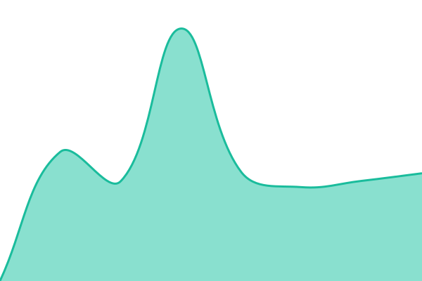

# [📈 Live Status](https://status.arcaptcha.ir): <!--live status--> **🟧 Partial outage**

This repository contains the open-source uptime monitor and status page for [Arcaptcha](https://arcaptcha.ir), powered by [Upptime](https://github.com/upptime/upptime).

With [Upptime](https://upptime.js.org), you can get your own unlimited and free uptime monitor and status page, powered entirely by a GitHub repository. We use [Issues](https://github.com/arcaptcha/ARCaptcha-monitoring/issues) as incident reports, [Actions](https://github.com/arcaptcha/ARCaptcha-monitoring/actions) as uptime monitors, and [Pages](https://status.arcaptcha.ir) for the status page.

<!--start: status pages-->
<!-- This summary is generated by Upptime (https://github.com/upptime/upptime) -->
<!-- Do not edit this manually, your changes will be overwritten -->
<!-- prettier-ignore -->
| URL | Status | History | Response Time | Uptime |
| --- | ------ | ------- | ------------- | ------ |
|  [ARCaptcha](https://arcaptcha.co/fa) | 🟩 Up | [ar-captcha.yml](https://github.com/arcaptcha/ARCaptcha-monitoring/commits/HEAD/history/ar-captcha.yml) | 

 2223ms
     
 | 

<a href="https://status.arcaptcha.ir/history/ar-captcha">100.00%</a>
    

|  [ARCaptcha widget](https://widget.arcaptcha.co/1/api.js) | 🟩 Up | [ar-captcha-widget.yml](https://github.com/arcaptcha/ARCaptcha-monitoring/commits/HEAD/history/ar-captcha-widget.yml) | 

 1372ms
     
 | 

<a href="https://status.arcaptcha.ir/history/ar-captcha-widget">100.00%</a>
    

|  [ARCaptcha API](https://api.arcaptcha.ir/arcaptcha/api/heartbeat) | 🟩 Up | [ar-captcha-api.yml](https://github.com/arcaptcha/ARCaptcha-monitoring/commits/HEAD/history/ar-captcha-api.yml) | 

 1089ms
     
 | 

<a href="https://status.arcaptcha.ir/history/ar-captcha-api">100.00%</a>
    

|  [RCaptcha API](https://rcaptcha.ir/arcaptcha/api/heartbeat) | 🟩 Up | [r-captcha-api.yml](https://github.com/arcaptcha/ARCaptcha-monitoring/commits/HEAD/history/r-captcha-api.yml) | 

 646ms
     
 | 

<a href="https://status.arcaptcha.ir/history/r-captcha-api">100.00%</a>
    

|  [ARCaptcha DE-API](https://de-api.arcaptcha.co/arcaptcha/api/heartbeat) | 🟥 Down | [ar-captcha-de-api.yml](https://github.com/arcaptcha/ARCaptcha-monitoring/commits/HEAD/history/ar-captcha-de-api.yml) | 

 0ms
     
 | 

<a href="https://status.arcaptcha.ir/history/ar-captcha-de-api">0.00%</a>
    

|  [ARCaptcha S3](https://api.arcaptcha.ir/arcaptcha/api/s3) | 🟩 Up | [ar-captcha-s3.yml](https://github.com/arcaptcha/ARCaptcha-monitoring/commits/HEAD/history/ar-captcha-s3.yml) | 

 1261ms
     
 | 

<a href="https://status.arcaptcha.ir/history/ar-captcha-s3">99.10%</a>
    

<!--end: status pages-->

[**Visit our status website →**](https://status.arcaptcha.ir)

## 📄 License

- Powered by: [Upptime](https://github.com/upptime/upptime)
- Code: [MIT](./LICENSE) © [Arcaptcha](https://arcaptcha.ir)
- Data in the `./history` directory: [Open Database License](https://opendatacommons.org/licenses/odbl/1-0/)
